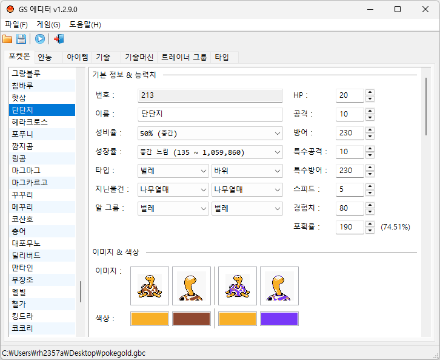

# GS 에디터

포켓몬스터 금 버전 편집기

## 미리보기

## 기능

* 포켓몬 정보, 이미지 등 편집
* 아이템 편집
* 기술·기술머신 편집
* 트레이너 이름, 이미지 편집
* 타입 이름, 상성 편집

## 작업 환경

### 개발 환경

* 윈도우10 (x64) 이상
* [msys2-mingw64](https://repo.msys2.org/distrib)
  * `MSYS2_HOME`: msys2 설치 경로 환경변수 등록 필요

### VSCode 확장

* `C/C++`: 디버그 실행 구성
* `clangd`: 언어 서버, 인텔리센스 구성

### 빌드 설명

* `make`: 프로젝트를 빌드합니다. `build/release/bin/GSEditor.exe`가 생성됩니다.
* `make source-watcher`: 소스 변경 감지기를 통하여 인텔리센스에 필요한 파일을 갱신합니다.
  * 갱신되는 파일
    * `build/compile_commands.json`

## 프로젝트 의존성

내부 프로세스를 제외한 항목들은 패키지 매니저에 미리 설치가 되어 있어야 합니다.

### 빌드

* `mingw-w64-x86_64-toolchain`: gcc, g++ 컴파일러
* `mingw-w64-x86_64-clang-tools-extra`: clangd 전용 (옵션)
* `upx`: 프로그램 압축 패킹
* `make`: 빌드툴

### 라이브러리

* `mingw-w64-x86_64-wxwidgets3.2-msw`: wxWidgets GUI 프레임워크
* `mingw-w64-x86_64-xxhash`: 문자열 해시
* `mingw-w64-x86_64-utf8cpp`: utf8 변환
* `lodepng`: png 라이브러리
* `xdelta3`: xdelta 패치 생성
* `argparse`: 프로그램 인자값 처리
* `json`: json 파서

### 내부 프로세스 실행

* `rgbds`: gbz80 어셈블러

### 필수 설치 패키지

* `make`
* `upx`
* `mingw-w64-x86_64-xxhash`
* `mingw-w64-x86_64-utf8cpp`
* `mingw-w64-x86_64-wxwidgets3.2-msw`
* `mingw-w64-x86_64-toolchain`
* `mingw-w64-x86_64-clang-tools-extra`

## 3자 라이선스 고지

* [ThirdPartyNotices.txt](res/ThirdPartyNotices.txt)
* 프로그램 정보에서 확인 (도움말 > 프로그램 정보 > 오픈소스 라이선스)
